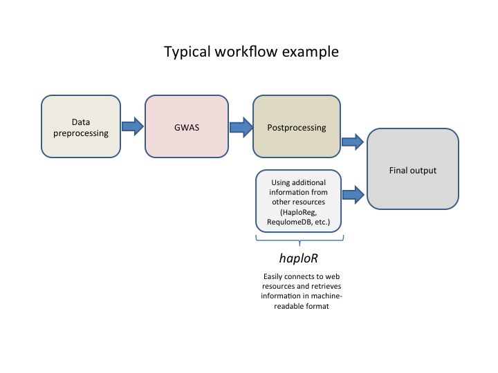

```{r, message=FALSE, echo=FALSE}
library(knitcitations)
cleanbib()
options("citation_format" = "pandoc")
r<-citep("10.1093/nar/gkr917") 
r<-citep("10.1101/gr.137323.112")
r<-citep("10.1093/bioinformatics/btv402")
write.bibtex(file="references.bib")
```


## Overview

HaploReg (<https://pubs.broadinstitute.org/mammals/haploreg/haploreg.php>) [@Ward_2011], 
RegulomeDB (<http://www.regulomedb.org>) [@Boyle_2012], and
LDlink (<https://analysistools.nci.nih.gov/LDlink/>) [@Machiela_2015]
are web-based tools that extract biological information such as eQTL, 
LD, LD matrices, motifs, etc. from large genomic projects such as ENCODE, 
the 1000 Genomes Project, Roadmap Epigenomics Project and others. 
This is sometimes called "post stage GWAS" analysis.

The R-package _haploR_ was developed to query 
those tools (HaploReg, RegulomeDB, LDlink) directly from 
_R_ in order to facilitate high-throughput 
genomic data analysis. Below we provide several examples 
that show how to work with this package.

Note: you must have a stable Internet connection 
to use this package.

Contact: <ilya.zhbannikov@duke.edu> for questions of 
usage the _haploR_ or any other issues.

### Motivation and typical analysis workflow

This package was inspired by the fact that many web-based post stage GWAS databases do not have Application Programing Interface (API) and, therefore, do not allow users to query them remotedly from R environment. In our research we used HaploReg and RegulomeDB web databases. These very useful web databases show information about linkage disequilibrium of query variants and variants which are in LD with them, expression quantitative trait loci (eQTL), motifs changed and other useful information. However, it is not easy to include this information into streamlined workflow since those tools also not offer API.

We developed a custom analysis pipeline which prepares data, performs genome-wide association (GWA) analysis and presents results in a user-friendly format. Results include a list of genetic variants (also known as 'SNP' or single nucleotide polymorphism), their corresponding _p_-values, phenotypes (traits) tested and other meta-information such as LD, alternative allele, minor allele frequency, motifs changed, etc. Of course, we could go throught the list of SNPs having genome-wide significant _p_-values (1e-8) and submit each of those SNPs to web-based tools manually, one-by-one, but it is time-consuming process and will not be fully automatic (which ruins one of the pipeline's paradigms). This is especially difficult if the web site does not offer downloading results.

Therefore, we developed _haploR_, a user-friendly R package that connects to the web tool from R environment with methods POST/GET and downloads results in a suitable R format. This package siginificantly saved our time in developing reporting system for our internal genomic analysis pipeline and now we would like to present _haploR_ to the research community.

Example of typical analysis workflow is shown below.



* Data preprocessing stage usually consists of basic cleaning operations (sex inconsistencies check, filtering by MAF, missing genotype rate), format conversion, population stratification, creating temporaty files, etc.
* Genome-wide association study (GWAS). This Includes testing hyphotesis on correlation between phenotype and genotype. Usually in form of linear or logistic regression but can be quite sophisticated especially for rare variants.
* Postprocessing usually includes summarizing results in tables, creating graphics (Manhattan plot, QQ-plot), sometimes filtering by significance threshold (usually 1E-8), removing temporary files, etc.
* Post stage GWAS analysis: connect GWAS findings with existing studies and gather information about linked SNPs, chromatin state, protein binding annotation, sequence conservation across mammals, effects on regulatory motifs and on gene expression, etc. This helps researchers to more understand functions and test additional hyphotesis of found genome-wide significant SNPs. At this stage _haploR_ is especially useful because it provides a convenient R interface to mining web databases. This, in turn, streamlines analysis workflow and therefore significantly reduces analysis time. Previously researchers had to do it manually after analysis by exploring available web resources, checking each SNP of interest and downloading results (which is especially painful if website does not have a download option). With _haploR_ such post-GWAS information are easily retrieved, shared and appeared in the final output tables at the end of analysis. This will save researchers' time.

## Installation of _haploR_ package

In order to install the _haploR_ package, the user must first install R (<https://www.r-project.org>). After that, _haploR_ can be installed either:

* From CRAN (stable version):
```{r, echo=TRUE, eval=FALSE}
install.packages("haploR", dependencies = TRUE)
```

* Or from the package web page (developing version):

```{r, echo=TRUE, eval=FALSE}
devtools::install_github("izhbannikov/haplor")
```


_haploR_ depends on the following packages: 

* _httr_, version 1.2.1 or later.
* _XML_, version version 3.98-1.6 or later.
* _tibble_, version 1.3.0 or later.
* _RUnit_, version 0.4.31 or later.
* _DT_, version 0.4 or later.

## Examples of usage

### Querying HaploReg

Function 
```
queryHaploreg(query = NULL, file = NULL, study = NULL, ldThresh = 0.8,
  ldPop = "EUR", epi = "vanilla", cons = "siphy", genetypes = "gencode",
  url = "https://pubs.broadinstitute.org/mammals/haploreg/haploreg.php",
  timeout = 10, encoding = "UTF-8", verbose = FALSE)
```

queries HaploReg web-based tool and returns results.

#### Arguments

* _query_:	Query (a vector of rsIDs).
* _file_:	A text file (one refSNP ID per line).
* _study_:	A particular study. See function getHaploRegStudyList(...). Default: ```NULL```.
* _ldThresh_:	LD threshold, r2 (select NA to show only query variants). Default: ```0.8```.
* _ldPop_:	1000G Phase 1 population for LD calculation. Can be: ```AFR``` (Africa), ```AMR``` (America), ```ASN``` (Asia). Default: ```EUR``` (Europe).
* _epi_: Source for epigenomes. Possible values: ```vanilla``` for ChromHMM (Core 15-state model); ```imputed``` for ChromHMM (25-state model using 12 imputed marks); ```methyl``` for H3K4me1/H3K4me3 peaks; ```acetyl``` for H3K27ac/H3K9ac peaks. Default: ```vanilla```.
* _cons_:	Mammalian conservation algorithm. Possible values: ```gerp``` for GERP (<http://mendel.stanford.edu/SidowLab/downloads/gerp/>), ```siphy``` for SiPhy-omega, ```both``` for both. Default: siphy.
* _genetypes_:	Show position relative to. Possible values: ```gencode``` for Gencode genes; ```refseq``` for RefSeq genes; ```both``` for both. Default: ```gencode```.
* _url_: HaploReg url address. Default: <https://pubs.broadinstitute.org/mammals/haploreg/haploreg.php>
* _timeout_:	A timeout parameter for curl. Default: ```10```
* _encoding_: Set the encoding for correct retrieval web-page content. Default: ```UTF-8```
* _verbose_: Verbosing output. Default: ```FALSE```.

#### Output

A data frame (table) wrapped into a _tibble_ object contains data extracted from HaploReg site. The colums (33 in total at the time of writing this vignette) are specific to HaploReg output. Below we describe the columns:

* _chr_: Chromosome, type: numeric
* _pos_hg38_: Position on the human genome, type: numeric.
* _r2_: Linkage disequilibrium. Type: numeric.
* D': Linkage disequilibrium, alternative definition. Type: numeric.
* _is_query_snp_: Indicator shows query SNP, 0 - not query SNP, 1 - query SNP. Type: numeric.
* _rsID_: refSNP ID. Type: character.
* _ref_: Reference allele. Type: character.
* _alt_: Alternative allele. Type: character.
* _AFR_: _r2_ calculated for Africa. Type: numeric.
* _AMR_: _r2_ calculated for America. Type: numeric.
* _ASN_: _r2_ calculated for Asia. Type: numeric.
* _EUR_: _r2_ calculated for Europe. Type: numeric.
* _GERP_cons_: GERP scores. Type: numeric.
* _SiPhy_cons_: SiPhy scores. Type: numeric.
* _Chromatin_States_: Chromatin states: reference epigenome identifiers (EID) of chromatin-associated proteins and histone modifications in that region. Type: character.
* _Chromatin_States_Imputed_: Chromatin states based on imputed data. Type: character.
* _Chromatin_Marks_: Chromatin marks Type: character.
* _DNAse_: DNAse. Type: chararcter.
* _Proteins_: A list of protein names. Type: character.
* _eQTL_: Expression Quantitative Trait Loci. Type: character.
* _gwas_: GWAS study name. Type: character.
* _grasp_: GRASP study name: character.
* _Motifs_: Motif names. Type: character.
* _GENCODE_id_: GENCODE transcript ID. Type: character.
* _GENCODE_name_: GENCODE gene name. Type: character.
* _GENCODE_direction_: GENCODE direction (transcription toward 3' or 5' end of the DNA sequence). Type: numeric.
* _GENCODE_distance_: GENCODE distance. Type: numeric.
* _RefSeq_id_: NCBI Reference Sequence Accession number. Type: character.
* _RefSeq_name_: NCBI Reference Sequence name. Type: character.
* _RefSeq_direction_: NCBI Reference Sequence direction (transcription toward 3' or 5' end of the DNA sequence). Type: numeric.
* _RefSeq_distance_: NCBI Reference Sequence distance. Type: numeric.
* _dbSNP_functional_annotation_ Annotated proteins associated with the SNP. Type: numeric. 
* _query_snp_rsid_: Query SNP rs ID. Type: character.
* _Promoter_histone_marks_: Promoter histone marks. Type: factor.
* _Enhancer_histone_marks_: Enhancer histone marks. Type: factor.

Number of rows is not constant, at least equal or more than the number of query SNPs, and depends on _r2_ parameter choosen in a query (default 0.8). This means that the program outputs not only query SNPs, but also those SNPs that have _r2_ $\geq$ 0.8 with the query SNPs.

#### One or several genetic variants

```{r, echo=TRUE, message=FALSE}
library(haploR)
x <- queryHaploreg(query=c("rs10048158","rs4791078"))
x
```

Here _query_ is a vector with names of genetic variants. 

We then can create a subset from the results, for example, to choose only SNPs with r2 $>$ 0.9:

```{r, echo=TRUE, message=FALSE}
subset.high.LD <- x[as.numeric(x$r2) > 0.9, c("rsID", "r2", "chr", "pos_hg38", "is_query_snp", "ref", "alt")]
subset.high.LD
```

We can then save the _subset.high.LD_ into an Excel workbook:

```{r, echo=TRUE, message=FALSE, eval=FALSE}
require(openxlsx)
write.xlsx(x=subset.high.LD, file="subset.high.LD.xlsx")
```


This was an example of gathering post-gwas information directly from the online tool. _haploR_ has an additional advantage because it downloads the full information for query retrieved by HaploReg. For example, if you go online and submit these two SNPs to HaploReg (<https://pubs.broadinstitute.org/mammals/haploreg/haploreg.php>), you will see that some cells of columns "Motifs changed" and "Selected eQTL hits" are hidded (only number of hits are given). _haploR_ retrives this information in a form of a data frame which can be saved into Excel file.

```{r, echo=TRUE, message=FALSE}
x[, c("Motifs", "rsID")]
x[, c("eQTL", "rsID")]
```

#### Uploading file with variants

If you have a file with your SNPs you would like 
to analyze, you can 
supply it as an input as follows:

```{r, echo=TRUE, message=FALSE}
library(haploR)
x <- queryHaploreg(file=system.file("extdata/snps.txt", package = "haploR"))
x
```

File "snps.txt" is a text file which contains one rs-ID per line:

```
rs10048158
rs4791078
```

#### Using existing studies

Sometimes one would like to explore results from 
already performed study. In this case you should 
first explore the existing studies from 
HaploReg web site (<https://pubs.broadinstitute.org/mammals/haploreg/haploreg.php>) and then use one of 
them as an input parameter. See example below:

```{r, echo=TRUE, message=FALSE}
library(haploR)
# Getting a list of existing studies:
studies <- getStudyList()
# Let us look at the first element:
studies[[1]]
# Let us look at the second element:
studies[[2]]
# Query Hploreg to explore results from 
# this study:
x <- queryHaploreg(study=studies[[1]])
x
```

#### Extended view of SNP

If you want to see more information about SNP of interest, you can use the ```getExtendedView```:
Parameters:
*```snp``` - A SNP of interest.
*```url``` - A url to the HaploReg. Default: "https://pubs.broadinstitute.org/mammals/haploreg/detail_v4.1.php?query=&id="

Return A list of tables ```t1```, ```t2```, ..., etc, depending on information contained in HaploReg database.

Example:

```{r, echo=TRUE, eval=FALSE, message=FALSE}
library(haploR)
tables <- getExtendedView(snp="rs10048158")
tables
```

### Querying RegulomeDB

To query RegulomeDB use this function:
```
queryRegulome(query = NULL, 
              format = "full",
              url = "http://www.regulomedb.org/results", 
              timeout = 10,
              check_bad_snps = TRUE, 
              verbose = FALSE)
```

This function queries RegulomeDB <http://www.regulomedb.org> web-based tool and returns results in a named list.

#### Arguments

* _query_: Query (a vector of rsIDs).
* _format_: An output format.  Only 'full' is currently supported. See ```http://www.regulomedb.org/results```. Can be on of the following: ```full``` - plain text, ```bed``` -  BED (Browser Extensible Data) format, see e.g. <https://genome.ucsc.edu/FAQ/FAQformat.html#format5.1>, ```gff``` - GFF (General Feature Format), see e.g. <https://genome.ucsc.edu/FAQ/FAQformat.html#format3>. Only ```full``` is currently supported. 
* _url_: Regulome url address.  Default: ```http://www.regulomedb.org/results```
* _timeout_: A 'timeout' parameter for 'curl'. Default: 10.
* _check_bad_snps_: Checks if all query SNPs are annotated (i.e. presented in the Regulome Database). Default: 'TRUE'
* _verbose_: Verbosing output. Default: FALSE.

#### Output

A list of two: (1) a data frame (res.table) wrapped to a _tibble_ object and (2) a list of bad SNP IDs (bad.snp.id).  Bad SNP ID are those IDs that were not found in 1000 Genomes Phase 1 data and, therefore, in RegulomeDB.

Columns in a data frame (res.table):

* _#chromosome_: Chromosome. Type: character.
* _coordinate_: Position. Type: numeric.
* _rsid_: RefSeq SNP ID. Type: character.
* _hits_: Contains information about chromatin structure: method and cell type. Type: character.
* _score_: Internal RegulomeDB score. See <http://www.regulomedb.org/help#score>. Type: numeric.

Number of rows is equal or less (in case if not all SNPs were found in RegulomeDB database) to number of query SNPs.

All the information retreived from RegulomeDB, except _hits_, are also presented in HaploReg output (```queryHaploReg(...)```).

#### Example

```{r, echo=TRUE, message=FALSE}
library(haploR)
x <- queryRegulome(c("rs4791078","rs10048158"))
x$res.table
x$bad.snp.id
```


### Querying LDlink

_LDlink_ (<https://analysistools.nci.nih.gov/LDlink/>) is a set of web-based tools that allow exloring Linkage Disequilibrium of provided set of SNPs. _LDlink_ allows for the following tools:

* _LDassoc_
* _LDhap_
* _LDmatrix_
* _LDpair_
* _LDproxy_
* _SNPchip_
* _SNPclip_

Currently _haploR_ supports _LDmatrix_ only but we are currently working on adding other tools from _LDlink_ project.

#### LDmatrix
Function 
```
LDlink.LDmatrix(snps, r2d = "r2", population = "ALL")
```

This function queries HaploReg web-based tool and returns results.

##### Arguments

* _snps_:	A list of snps (a vector of rsIDs, or a file, one SNP per line).
* _population_:	A particular population. Default: ```ALL```.

##### Value

A list of two: (1) raw LD r2 matrix, (2) raw LD D-prime matrix.

##### Example

```{r, echo=TRUE, message=FALSE}
library(haploR)
ldmat <- LDlink.LDmatrix(snps=c("rs77264218", "rs11229158", "rs10896659", "rs10896702", "rs2042592"), population="AFR")
ldmat
# Stylish matrix R2
stylish.matrix.r2 <- makeStylishLDmatrix(ldmat$matrix.r2)
stylish.matrix.r2
# Stylish matrix D'
stylish.matrix.Dprime <- makeStylishLDmatrix(ldmat$matrix.dprime)
stylish.matrix.Dprime
```


### Roadmap cell types

The Roadmap Epigenomics project employs data organization schema based on anatomical origin of the data (see Roadmap Epigenomics web site).

| EID  | GROUP          | ANATOMY            | GR              | Epigenome Mnemonic         | Standardized Epigenome name (from Wouter)                      | Epigenome name (from EDACC Release 9 directory)                            | TYPE           |
|------|----------------|--------------------|-----------------|----------------------------|----------------------------------------------------------------|----------------------------------------------------------------------------|----------------|
| E033 | Blood & T-cell | BLOOD              | Blood_and_Tcell | BLD.CD3.CPC                | Primary T cells from cord blood                                | CD3_Primary_Cells_Cord_BI                                                  | PrimaryCell    |
| E034 | Blood & T-cell | BLOOD              | Blood_and_Tcell | BLD.CD3.PPC                | Primary T cells from peripheral blood                          | CD3_Primary_Cells_Peripheral_UW                                            | PrimaryCell    |
| E037 | Blood & T-cell | BLOOD              | Blood_and_Tcell | BLD.CD4.MPC                | Primary T helper memory cells from peripheral blood 2          | CD4_Memory_Primary_Cells                                                   | PrimaryCell    |
| E038 | Blood & T-cell | BLOOD              | Blood_and_Tcell | BLD.CD4.NPC                | Primary T helper naive cells from peripheral blood             | CD4_Naive_Primary_Cells                                                    | PrimaryCell    |
| E039 | Blood & T-cell | BLOOD              | Blood_and_Tcell | BLD.CD4.CD25M.CD45RA.NPC   | Primary T helper naive cells from peripheral blood             | CD4+_CD25-_CD45RA+_Naive_Primary_Cells                                     | PrimaryCell    |
| E040 | Blood & T-cell | BLOOD              | Blood_and_Tcell | BLD.CD4.CD25M.CD45RO.MPC   | Primary T helper memory cells from peripheral blood 1          | CD4+_CD25-_CD45RO+_Memory_Primary_Cells                                    | PrimaryCell    |
| E041 | Blood & T-cell | BLOOD              | Blood_and_Tcell | BLD.CD4.CD25M.IL17M.PL.TPC | Primary T helper cells PMA-I stimulated                        | CD4+_CD25-_IL17-_PMA-Ionomycin_stimulated_MACS_purified_Th_Primary_Cells   
            | PrimaryCell    |
| E042 | Blood & T-cell | BLOOD              | Blood_and_Tcell | BLD.CD4.CD25M.IL17P.PL.TPC | Primary T helper 17 cells PMA-I stimulated                     | CD4+_CD25-_IL17+_PMA-Ionomcyin_stimulated_Th17_Primary_Cells               | PrimaryCell    |
| E043 | Blood & T-cell | BLOOD              | Blood_and_Tcell | BLD.CD4.CD25M.TPC          | Primary T helper cells from peripheral blood                   | CD4+_CD25-_Th_Primary_Cells                                                | PrimaryCell    |
| E044 | Blood & T-cell | BLOOD              | Blood_and_Tcell | BLD.CD4.CD25.CD127M.TREGPC | Primary T regulatory cells from peripheral blood               | CD4+_CD25+_CD127-_Treg_Primary_Cells                                       | PrimaryCell    |
| E045 | Blood & T-cell | BLOOD              | Blood_and_Tcell | BLD.CD4.CD25I.CD127.TMEMPC | Primary T cells effector/memory enriched from peripheral blood | CD4+_CD25int_CD127+_Tmem_Primary_Cells                                     | PrimaryCell    |
| E047 | Blood & T-cell | BLOOD              | Blood_and_Tcell | BLD.CD8.NPC                | Primary T CD8+ naive cells from peripheral blood               | CD8_Naive_Primary_Cells                                                    | PrimaryCell    |
| E048 | Blood & T-cell | BLOOD              | Blood_and_Tcell | BLD.CD8.MPC                | Primary T CD8+ memory cells from peripheral blood              | CD8_Memory_Primary_Cells                                                   | PrimaryCell    |
| E062 | Blood & T-cell | BLOOD              | Blood_and_Tcell | BLD.PER.MONUC.PC           | Primary mononuclear cells from peripheral blood                | Peripheral_Blood_Mononuclear_Primary_Cells                                 | PrimaryCell    |
| E053 | Neurosph       | BRAIN              | Brain           | BRN.CRTX.DR.NRSPHR         | Cortex derived primary cultured neurospheres                   | Neurosphere_Cultured_Cells_Cortex_Derived                                  | PrimaryCulture |
| E054 | Neurosph       | BRAIN              | Brain           | BRN.GANGEM.DR.NRSPHR       | Ganglion Eminence derived primary cultured neurospheres        | Neurosphere_Cultured_Cells_Ganglionic_Eminence_Derived                     | PrimaryCulture |
| E067 | Brain          | BRAIN              | Brain           | BRN.ANG.GYR                | Brain Angular Gyrus                                            | Brain_Angular_Gyrus                                                        | PrimaryTissue  |
| E068 | Brain          | BRAIN              | Brain           | BRN.ANT.CAUD               | Brain Anterior Caudate                                         | Brain_Anterior_Caudate                                                     | PrimaryTissue  |
| E069 | Brain          | BRAIN              | Brain           | BRN.CING.GYR               | Brain Cingulate Gyrus                                          | Brain_Cingulate_Gyrus                                                      | PrimaryTissue  |
| E070 | Brain          | BRAIN              | Brain           | BRN.GRM.MTRX               | Brain Germinal Matrix                                          | Brain_Germinal_Matrix                                                      | PrimaryTissue  |
| E071 | Brain          | BRAIN              | Brain           | BRN.HIPP.MID               | Brain Hippocampus Middle                                       | Brain_Hippocampus_Middle                                                   | PrimaryTissue  |
| E072 | Brain          | BRAIN              | Brain           | BRN.INF.TMP                | Brain Inferior Temporal Lobe                                   | Brain_Inferior_Temporal_Lobe                                               | PrimaryTissue  |
| E073 | Brain          | BRAIN              | Brain           | BRN.DL.PRFRNTL.CRTX        | Brain_Dorsolateral_Prefrontal_Cortex                           | Brain_Mid_Frontal_Lobe                                                     | PrimaryTissue  |
| E074 | Brain          | BRAIN              | Brain           | BRN.SUB.NIG                | Brain Substantia Nigra                                         | Brain_Substantia_Nigra                                                     | PrimaryTissue  |
| E081 | Brain          | BRAIN              | Brain           | BRN.FET.M                  | Fetal Brain Male                                               | Fetal_Brain_Male                                                           | PrimaryTissue  |
| E082 | Brain          | BRAIN              | Brain           | BRN.FET.F                  | Fetal Brain Female                                             | Fetal_Brain_Female                                                         | PrimaryTissue  |
| E075 | Digestive      | GI_COLON           | Digestive       | GI.CLN.MUC                 | Colonic Mucosa                                                 | Colonic_Mucosa                                                             | PrimaryTissue  |
| E077 | Digestive      | GI_DUODENUM        | Digestive       | GI.DUO.MUC                 | Duodenum Mucosa                                                | Duodenum_Mucosa                                                            | PrimaryTissue  |
| E079 | Digestive      | GI_ESOPHAGUS       | Digestive       | GI.ESO                     | Esophagus                                                      | Esophagus                                                                  | PrimaryTissue  |
| E084 | Digestive      | GI_INTESTINE       | Digestive       | GI.L.INT.FET               | Fetal Intestine Large                                          | Fetal_Intestine_Large                                                      | PrimaryTissue  |
| E085 | Digestive      | GI_INTESTINE       | Digestive       | GI.S.INT.FET               | Fetal Intestine Small                                          | Fetal_Intestine_Small                                                      | PrimaryTissue  |
| E092 | Digestive      | GI_STOMACH         | Digestive       | GI.STMC.FET                | Fetal Stomach                                                  | Fetal_Stomach                                                              | PrimaryTissue  |
| E094 | Digestive      | GI_STOMACH         | Digestive       | GI.STMC.GAST               | Gastric                                                        | Gastric                                                                    | PrimaryTissue  |
| E101 | Digestive      | GI_RECTUM          | Digestive       | GI.RECT.MUC.29             | Rectal Mucosa Donor 29                                         | Rectal_Mucosa.Donor_29                                                     | PrimaryTissue  |
| E102 | Digestive      | GI_RECTUM          | Digestive       | GI.RECT.MUC.31             | Rectal Mucosa Donor 31                                         | Rectal_Mucosa.Donor_31                                                     | PrimaryTissue  |
| E106 | Digestive      | GI_COLON           | Digestive       | GI.CLN.SIG                 | Sigmoid Colon                                                  | Sigmoid_Colon                                                              | PrimaryTissue  |
| E109 | Digestive      | GI_INTESTINE       | Digestive       | GI.S.INT                   | Small Intestine                                                | Small_Intestine                                                            | PrimaryTissue  |
| E110 | Digestive      | GI_STOMACH         | Digestive       | GI.STMC.MUC                | Stomach Mucosa                                                 | Stomach_Mucosa                                                             | PrimaryTissue  |
| E114 | ENCODE2012     | LUNG               | ENCODE2012      | LNG.A549.ETOH002.CNCR      | A549 EtOH 0.02pct Lung Carcinoma Cell Line                     | A549_EtOH_0.02pct_Lung_Carcinoma                                           | CellLine       |
| E115 | ENCODE2012     | BLOOD              | ENCODE2012      | BLD.DND41.CNCR             | Dnd41 TCell Leukemia Cell Line                                 | Dnd41_TCell_Leukemia                                                       | CellLine       |
| E116 | ENCODE2012     | BLOOD              | ENCODE2012      | BLD.GM12878                | GM12878 Lymphoblastoid Cells                                   | GM12878_Lymphoblastoid                                                     | PrimaryCulture |
| E117 | ENCODE2012     | CERVIX             | ENCODE2012      | CRVX.HELAS3.CNCR           | HeLa-S3 Cervical Carcinoma Cell Line                           | HeLa-S3_Cervical_Carcinoma                                                 | CellLine       |
| E118 | ENCODE2012     | LIVER              | ENCODE2012      | LIV.HEPG2.CNCR             | HepG2 Hepatocellular Carcinoma Cell Line                       | HepG2_Hepatocellular_Carcinoma                                             | CellLine       |
| E119 | ENCODE2012     | BREAST             | ENCODE2012      | BRST.HMEC                  | HMEC Mammary Epithelial Primary Cells                          | HMEC_Mammary_Epithelial                                                    | PrimaryCulture |
| E120 | ENCODE2012     | MUSCLE             | ENCODE2012      | MUS.HSMM                   | HSMM Skeletal Muscle Myoblasts Cells                           | HSMM_Skeletal_Muscle_Myoblasts                                             | PrimaryCulture |
| E121 | ENCODE2012     | MUSCLE             | ENCODE2012      | MUS.HSMMT                  | HSMM cell derived Skeletal Muscle Myotubes Cells               | HSMMtube_Skeletal_Muscle_Myotubes_Derived_from_HSMM                        | PrimaryCulture |
| E122 | ENCODE2012     | VASCULAR           | ENCODE2012      | VAS.HUVEC                  | HUVEC Umbilical Vein Endothelial Primary Cells                 | HUVEC_Umbilical_Vein_Endothelial_Cells                                     | PrimaryCulture |
| E123 | ENCODE2012     | BLOOD              | ENCODE2012      | BLD.K562.CNCR              | K562 Leukemia Cells                                            | K562_Leukemia                                                              | PrimaryCulture |
| E124 | ENCODE2012     | BLOOD              | ENCODE2012      | BLD.CD14.MONO              | Monocytes-CD14+ RO01746 Primary Cells                          | Monocytes-CD14+_RO01746                                                    | PrimaryCell    |
| E125 | ENCODE2012     | BRAIN              | ENCODE2012      | BRN.NHA                    | NH-A Astrocytes Primary Cells                                  | NH-A_Astrocytes                                                            | PrimaryCulture |
| E126 | ENCODE2012     | SKIN               | ENCODE2012      | SKIN.NHDFAD                | NHDF-Ad Adult Dermal Fibroblast Primary Cells                  | NHDF-Ad_Adult_Dermal_Fibroblasts                                           | PrimaryCulture |
| E127 | ENCODE2012     | SKIN               | ENCODE2012      | SKIN.NHEK                  | NHEK-Epidermal Keratinocyte Primary Cells                      | NHEK-Epidermal_Keratinocytes                                               | PrimaryCulture |
| E128 | ENCODE2012     | LUNG               | ENCODE2012      | LNG.NHLF                   | NHLF Lung Fibroblast Primary Cells                             | NHLF_Lung_Fibroblasts                                                      | PrimaryCulture |
| E129 | ENCODE2012     | BONE               | ENCODE2012      | BONE.OSTEO                 | Osteoblast Primary Cells                                       | Osteoblasts                                                                | PrimaryCulture |
| E027 | Epithelial     | BREAST             | Epithelial      | BRST.MYO                   | Breast Myoepithelial Primary Cells                             | Breast_Myoepithelial_Cells                                                 | PrimaryCell    |
| E028 | Epithelial     | BREAST             | Epithelial      | BRST.HMEC.35               | Breast variant Human Mammary Epithelial Cells (vHMEC)          | Breast_vHMEC                                                               | PrimaryCulture |
| E055 | Epithelial     | SKIN               | Epithelial      | SKIN.PEN.FRSK.FIB.01       | Foreskin Fibroblast Primary Cells skin01                       | Penis_Foreskin_Fibroblast_Primary_Cells_skin01                             | PrimaryCulture |
| E056 | Epithelial     | SKIN               | Epithelial      | SKIN.PEN.FRSK.FIB.02       | Foreskin Fibroblast Primary Cells skin02                       | Penis_Foreskin_Fibroblast_Primary_Cells_skin02                             | PrimaryCulture |
| E057 | Epithelial     | SKIN               | Epithelial      | SKIN.PEN.FRSK.KER.02       | Foreskin Keratinocyte Primary Cells skin02                     | Penis_Foreskin_Keratinocyte_Primary_Cells_skin02                           | PrimaryCulture |
| E058 | Epithelial     | SKIN               | Epithelial      | SKIN.PEN.FRSK.KER.03       | Foreskin Keratinocyte Primary Cells skin03                     | Penis_Foreskin_Keratinocyte_Primary_Cells_skin03                           | PrimaryCulture |
| E059 | Epithelial     | SKIN               | Epithelial      | SKIN.PEN.FRSK.MEL.01       | Foreskin Melanocyte Primary Cells skin01                       | Penis_Foreskin_Melanocyte_Primary_Cells_skin01                             | PrimaryCulture |
| E061 | Epithelial     | SKIN               | Epithelial      | SKIN.PEN.FRSK.MEL.03       | Foreskin Melanocyte Primary Cells skin03                       | Penis_Foreskin_Melanocyte_Primary_Cells_skin03                             | PrimaryCulture |
| E004 | ES-deriv       | ESC_DERIVED        | ES-deriv        | ESDR.H1.BMP4.MESO          | H1 BMP4 Derived Mesendoderm Cultured Cells                     | H1_BMP4_Derived_Mesendoderm_Cultured_Cells                                 | ESCDerived     |
| E005 | ES-deriv       | ESC_DERIVED        | ES-deriv        | ESDR.H1.BMP4.TROP          | H1 BMP4 Derived Trophoblast Cultured Cells                     | H1_BMP4_Derived_Trophoblast_Cultured_Cells                                 | ESCDerived     |
| E006 | ES-deriv       | ESC_DERIVED        | ES-deriv        | ESDR.H1.MSC                | H1 Derived Mesenchymal Stem Cells                              | H1_Derived_Mesenchymal_Stem_Cells                                          | ESCDerived     |
| E007 | ES-deriv       | ESC_DERIVED        | ES-deriv        | ESDR.H1.NEUR.PROG          | H1 Derived Neuronal Progenitor Cultured Cells                  | H1_Derived_Neuronal_Progenitor_Cultured_Cells                              | ESCDerived     |
| E009 | ES-deriv       | ESC_DERIVED        | ES-deriv        | ESDR.H9.NEUR.PROG          | H9 Derived Neuronal Progenitor Cultured Cells                  | H9_Derived_Neuronal_Progenitor_Cultured_Cells                              | ESCDerived     |
| E010 | ES-deriv       | ESC_DERIVED        | ES-deriv        | ESDR.H9.NEUR               | H9 Derived Neuron Cultured Cells                               | H9_Derived_Neuron_Cultured_Cells                                           | ESCDerived     |
| E011 | ES-deriv       | ESC_DERIVED        | ES-deriv        | ESDR.CD184.ENDO            | hESC Derived CD184+ Endoderm Cultured Cells                    | hESC_Derived_CD184+_Endoderm_Cultured_Cells                                | ESCDerived     |
| E012 | ES-deriv       | ESC_DERIVED        | ES-deriv        | ESDR.CD56.ECTO             | hESC Derived CD56+ Ectoderm Cultured Cells                     | hESC_Derived_CD56+_Ectoderm_Cultured_Cells                                 | ESCDerived     |
| E013 | ES-deriv       | ESC_DERIVED        | ES-deriv        | ESDR.CD56.MESO             | hESC Derived CD56+ Mesoderm Cultured Cells                     | hESC_Derived_CD56+_Mesoderm_Cultured_Cells                                 | ESCDerived     |
| E001 | ESC            | ESC                | ESC             | ESC.I3                     | ES-I3 Cells                                                    | ES-I3_Cell_Line                                                            | PrimaryCulture |
| E002 | ESC            | ESC                | ESC             | ESC.WA7                    | ES-WA7 Cells                                                   | ES-WA7_Cell_Line                                                           | PrimaryCulture |
| E003 | ESC            | ESC                | ESC             | ESC.H1                     | H1 Cells                                                       | H1_Cell_Line                                                               | PrimaryCulture |
| E008 | ESC            | ESC                | ESC             | ESC.H9                     | H9 Cells                                                       | H9_Cell_Line                                                               | PrimaryCulture |
| E014 | ESC            | ESC                | ESC             | ESC.HUES48                 | HUES48 Cells                                                   | HUES48_Cell_Line                                                           | PrimaryCulture |
| E015 | ESC            | ESC                | ESC             | ESC.HUES6                  | HUES6 Cells                                                    | HUES6_Cell_Line                                                            | PrimaryCulture |
| E016 | ESC            | ESC                | ESC             | ESC.HUES64                 | HUES64 Cells                                                   | HUES64_Cell_Line                                                           | PrimaryCulture |
| E024 | ESC            | ESC                | ESC             | ESC.4STAR                  | ES-UCSF4 Cells                                                 | 4star                                                                      | PrimaryCulture |
| E065 | Heart          | VASCULAR           | Heart           | VAS.AOR                    | Aorta                                                          | Aorta                                                                      | PrimaryTissue  |
| E083 | Heart          | HEART              | Heart           | HRT.FET                    | Fetal Heart                                                    | Fetal_Heart                                                                | PrimaryTissue  |
| E095 | Heart          | HEART              | Heart           | HRT.VENT.L                 | Left Ventricle                                                 | Left_Ventricle                                                             | PrimaryTissue  |
| E104 | Heart          | HEART              | Heart           | HRT.ATR.R                  | Right Atrium                                                   | Right_Atrium                                                               | PrimaryTissue  |
| E105 | Heart          | HEART              | Heart           | HRT.VNT.R                  | Right Ventricle                                                | Right_Ventricle                                                            | PrimaryTissue  |
| E029 | HSC & B-cell   | BLOOD              | HSC_and_Bcell   | BLD.CD14.PC                | Primary monocytes from peripheral blood                        | CD14_Primary_Cells                                                         | PrimaryCell    |
| E030 | HSC & B-cell   | BLOOD              | HSC_and_Bcell   | BLD.CD15.PC                | Primary neutrophils from peripheral blood                      | CD15_Primary_Cells                                                         | PrimaryCell    |
| E031 | HSC & B-cell   | BLOOD              | HSC_and_Bcell   | BLD.CD19.CPC               | Primary B cells from cord blood                                | CD19_Primary_Cells_Cord_BI                                                 | PrimaryCell    |
| E032 | HSC & B-cell   | BLOOD              | HSC_and_Bcell   | BLD.CD19.PPC               | Primary B cells from peripheral blood                          | CD19_Primary_Cells_Peripheral_UW                                           | PrimaryCell    |
| E035 | HSC & B-cell   | BLOOD              | HSC_and_Bcell   | BLD.CD34.PC                | Primary hematopoietic stem cells                               | CD34_Primary_Cells                                                         | PrimaryCell    |
| E036 | HSC & B-cell   | BLOOD              | HSC_and_Bcell   | BLD.CD34.CC                | Primary hematopoietic stem cells short term culture            | CD34_Cultured_Cells                                                        | PrimaryCell    |
| E046 | HSC & B-cell   | BLOOD              | HSC_and_Bcell   | BLD.CD56.PC                | Primary Natural Killer cells from peripheral blood             | CD56_Primary_Cells                                                         | PrimaryCell    |
| E050 | HSC & B-cell   | BLOOD              | HSC_and_Bcell   | BLD.MOB.CD34.PC.F          | Primary hematopoietic stem cells G-CSF-mobilized Female        | Mobilized_CD34_Primary_Cells_Female                                        | PrimaryCell    |
| E051 | HSC & B-cell   | BLOOD              | HSC_and_Bcell   | BLD.MOB.CD34.PC.M          | Primary hematopoietic stem cells G-CSF-mobilized Male          | Mobilized_CD34_Primary_Cells_Male                                          | PrimaryCell    |
| E018 | iPSC           | IPSC               | iPSC            | IPSC.15b                   | iPS-15b Cells                                                  | iPS-15b_Cell_Line                                                          | PrimaryCulture |
| E019 | iPSC           | IPSC               | iPSC            | IPSC.18                    | iPS-18 Cells                                                   | iPS-18_Cell_Line                                                           | PrimaryCulture |
| E020 | iPSC           | IPSC               | iPSC            | IPSC.20B                   | iPS-20b Cells                                                  | iPS-20b_Cell_Line                                                          | PrimaryCulture |
| E021 | iPSC           | IPSC               | iPSC            | IPSC.DF.6.9                | iPS DF 6.9 Cells                                               | iPS_DF_6.9_Cell_Line                                                       | PrimaryCulture |
| E022 | iPSC           | IPSC               | iPSC            | IPSC.DF.19.11              | iPS DF 19.11 Cells                                             | iPS_DF_19.11_Cell_Line                                                     | PrimaryCulture |
| E023 | Mesench        | FAT                | Mesench         | FAT.MSC.DR.ADIP            | Mesenchymal Stem Cell Derived Adipocyte Cultured Cells         | Mesenchymal_Stem_Cell_Derived_Adipocyte_Cultured_Cells                     | PrimaryCulture |
| E025 | Mesench        | FAT                | Mesench         | FAT.ADIP.DR.MSC            | Adipose Derived Mesenchymal Stem Cell Cultured Cells           | Adipose_Derived_Mesenchymal_Stem_Cell_Cultured_Cells                       | PrimaryCulture |
| E026 | Mesench        | STROMAL_CONNECTIVE | Mesench         | STRM.MRW.MSC               | Bone Marrow Derived Cultured Mesenchymal Stem Cells            | Bone_Marrow_Derived_Mesenchymal_Stem_Cell_Cultured_Cells                   | PrimaryCulture |
| E049 | Mesench        | STROMAL_CONNECTIVE | Mesench         | STRM.CHON.MRW.DR.MSC       | Mesenchymal Stem Cell Derived Chondrocyte Cultured Cells       | Chondrocytes_from_Bone_Marrow_Derived_Mesenchymal_Stem_Cell_Cultured_Cells | PrimaryCulture |
| E052 | Myosat         | MUSCLE             | Muscle          | MUS.SAT                    | Muscle Satellite Cultured Cells                                | Muscle_Satellite_Cultured_Cells                                            | PrimaryCulture |
| E089 | Muscle         | MUSCLE             | Muscle          | MUS.TRNK.FET               | Fetal Muscle Trunk                                             | Fetal_Muscle_Trunk                                                         | PrimaryTissue  |
| E090 | Muscle         | MUSCLE_LEG         | Muscle          | MUS.LEG.FET                | Fetal Muscle Leg                                               | Fetal_Muscle_Leg                                                           | PrimaryTissue  |
| E100 | Muscle         | MUSCLE             | Muscle          | MUS.PSOAS                  | Psoas Muscle                                                   | Psoas_Muscle                                                               | PrimaryTissue  |
| E107 | Muscle         | MUSCLE             | Muscle          | MUS.SKLT.M                 | Skeletal Muscle Male                                           | Skeletal_Muscle_Male                                                       | PrimaryTissue  |
| E108 | Muscle         | MUSCLE             | Muscle          | MUS.SKLT.F                 | Skeletal Muscle Female                                         | Skeletal_Muscle_Female                                                     | PrimaryTissue  |
| E017 | IMR90          | LUNG               | Other           | LNG.IMR90                  | IMR90 fetal lung fibroblasts Cell Line                         | IMR90_Cell_Line                                                            | CellLine       |
| E063 | Adipose        | FAT                | Other           | FAT.ADIP.NUC               | Adipose Nuclei                                                 | Adipose_Nuclei                                                             | PrimaryTissue  |
| E066 | Other          | LIVER              | Other           | LIV.ADLT                   | Liver                                                          | Adult_Liver                                                                | PrimaryTissue  |
| E076 | Sm. Muscle     | GI_COLON           | Other           | GI.CLN.SM.MUS              | Colon Smooth Muscle                                            | Colon_Smooth_Muscle                                                        | PrimaryTissue  |
| E078 | Sm. Muscle     | GI_DUODENUM        | Other           | GI.DUO.SM.MUS              | Duodenum Smooth Muscle                                         | Duodenum_Smooth_Muscle                                                     | PrimaryTissue  |
| E080 | Other          | ADRENAL            | Other           | ADRL.GLND.FET              | Fetal Adrenal Gland                                            | Fetal_Adrenal_Gland                                                        | PrimaryTissue  |
| E086 | Other          | KIDNEY             | Other           | KID.FET                    | Fetal Kidney                                                   | Fetal_Kidney                                                               | PrimaryTissue  |
| E087 | Other          | PANCREAS           | Other           | PANC.ISLT                  | Pancreatic Islets                                              | Pancreatic_Islets                                                          | PrimaryTissue  |
| E088 | Other          | LUNG               | Other           | LNG.FET                    | Fetal Lung                                                     | Fetal_Lung                                                                 | PrimaryTissue  |
| E091 | Other          | PLACENTA           | Other           | PLCNT.FET                  | Placenta                                                       | Fetal_Placenta                                                             | PrimaryTissue  |
| E093 | Thymus         | THYMUS             | Other           | THYM.FET                   | Fetal Thymus                                                   | Fetal_Thymus                                                               | PrimaryTissue  |
| E096 | Other          | LUNG               | Other           | LNG                        | Lung                                                           | Lung                                                                       | PrimaryTissue  |
| E097 | Other          | OVARY              | Other           | OVRY                       | Ovary                                                          | Ovary                                                                      | PrimaryTissue  |
| E098 | Other          | PANCREAS           | Other           | PANC                       | Pancreas                                                       | Pancreas                                                                   | PrimaryTissue  |
| E099 | Other          | PLACENTA           | Other           | PLCNT.AMN                  | Placenta Amnion                                                | Placenta_Amnion                                                            | PrimaryTissue  |
| E103 | Sm. Muscle     | GI_RECTUM          | Other           | GI.RECT.SM.MUS             | Rectal Smooth Muscle                                           | Rectal_Smooth_Muscle                                                       | PrimaryTissue  |
| E111 | Sm. Muscle     | GI_STOMACH         | Other           | GI.STMC.MUS                | Stomach Smooth Muscle                                          | Stomach_Smooth_Muscle                                                      | PrimaryTissue  |
| E112 | Thymus         | THYMUS             | Other           | THYM                       | Thymus                                                         | Thymus                                                                     | PrimaryTissue  |
| E113 | Other          | SPLEEN             | Other           | SPLN                       | Spleen                                                         | Spleen                                                                     | PrimaryTissue  |


## Session information
```{r, echo=TRUE}
sessionInfo()
```

##References